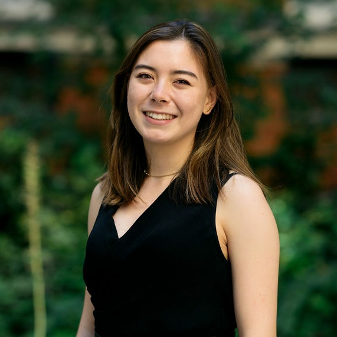

   
I am a scientist, generalist and tea enthusiast. 

I lead Business Development at [Cyted](cyted.ai), a provider of digital diagnostics infrastructure to revolutionise the early detection of cancer.

When I'm not working, I am reading, playing music, and exploring. Wherever I am, a cup of tea is not far.

## Projects & Interests

For a summary, you can [view my CV.](CV_Charlene_Tang_2021-01.pdf)

I graduated from Trinity College, University of Cambridge with a First-in-Class Masters in Natural Sciences, where I specialised in Biochemistry. 

I have gathered over 15 months of academic [research](projects.md) experience, from tumour immunology and virology, to bioinformatics and synthetic biology. Over the past 2 years, I have expanded my business skill set across the innovation ecosystem. 

I am [driven by](interests.md) increasing access to scientific understanding, technological advances, and opportunities for self development.

## Contact
Drop me an [email](emailto:charleneostang@yahoo.com) or message me on [LinkedIn](http://linkedin.com/in/charleneostang). 

Always up for a chat, check out my availability on [Calendly](https://calendly.com/charleneostang/30min).
