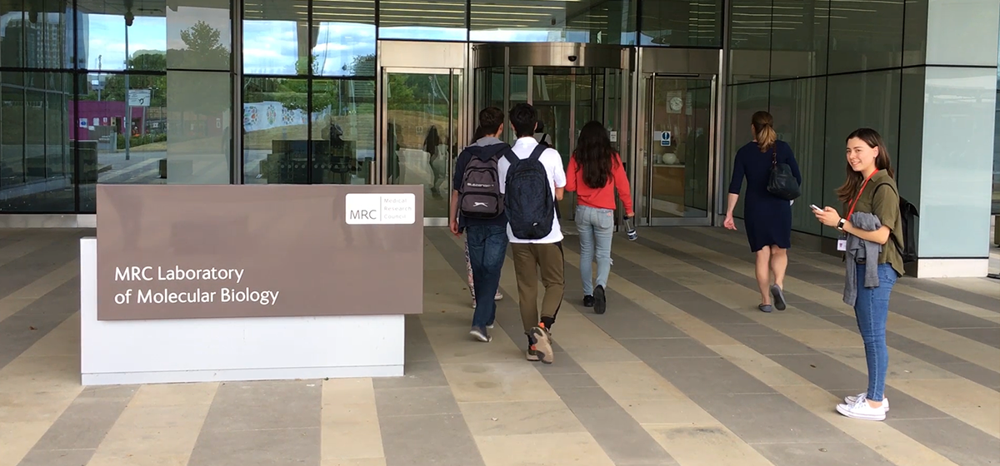

# Constant improvement
I am driven by overcoming life challenges. I have navigated cultural dynamics and survived family health emergencies by making these barriers my fuel. 

* I am mixed (half Chinese, half Irish) and grew up in 5 countries across 3 continents (HK, Singapore, Korea, Brazil, UK). This empowers me to bridge the gap betweeen contrasting approaches. 

* My mother was diagnosed with late-stage cervical cancer in 2009 and passed away a year later. Following the confusion surrounding her diagnosis and treatment options, I dedicated my learnings and [research projects](projects.md) to understanding scientfic principles and furthering technological advances.

* In 2017 and 2019, my father suffered from a series of strokes and now lives with heart failure. This fuelled my time at [Heartfelt Technologies](https://www.hftech.org), a MedTech developing an in-home monitoring device to predict heart failure hospitalisation, where I evaluated their technology by talking to the team, patients and their carers.

Altogether, these learning curves have consolidated my determination for kaizen (constant improvement) in myself and those I reach.

# Access potential 

I am determined to support others in their own journey towards awareness, resilience and purpose. 

I mentor my peers through life transitions and learning curves:
* Post-graduate routes across the innovation ecosystem from academia to corporates and SMEs
* Applications for summer research projects, industrial internships, and PhD research
*	The Natural Sciences Undergraduate degree at the University of Cambridge
*	UCAS applications and Oxbridge interviews
* [British Biology Olympiad](https://ukbiologycompetitions.org) and Finals

This initiative has grown through my Science Societies across the University of Cambridge, my Sixth Form Bio & Chem Society, volunteering for platforms such as [ProjectAccess.org](https://projectaccess.org), and volunteering for Trinity College Access & Outreach (highlight: [the Stonehouse residential](https://www.trin.cam.ac.uk/news/why-volunteering-on-the-stonehouse-residential-was-the-highlight-of-my-summer/)).

Over the past 4 years, I have developed a bank of resources and presentations. Please do reach out if you would be interested in accessing these.
 
# Communicate understanding
Over the past 5 years, I have founded, supported and led over 5 student societies.

1. **As Co-President of the [Cambridge University Scientific Society](http://scisoc.com) (2018-19)**, I organised and chaired 15 lectures by leading academic researchers. I launched, coordinated, chaired and presented at our annual Academic & Industrial Internships Event for Undergraduates on scientific research and alternative directions, from biotech venture building to early-stage investment.

2. **As Awareness Co-Ordinator at [Students for Global Health](https://studentsforglobalhealth.org), Cambridge (2019)**, I managed a team of 7 to create publicity campaigns and workshops addressing global health issues, from sleep and mental health evenings in Colleges to classes on antimicrobial resistance for Year 9 students.

3. **As Publicity Officer of the [Trinity College Science Society](https://tcss.soc.srcf.net) (2017-18)**, I developed and executed a strategy to advertise talks and events on 7 social media platforms weekly, doubling the mailing list reach and talk attendance during my first term in office.

4. **As the Founding Publicity Officer for Students for Rare Disease, Cambridge (2016-17)**, I worked in a team of clinical students and PhD scientists as the only Undergraduate to develop and launch our social media strategy for talks and events.

5. **As the President of my Sixth Form Bio & Chem Society (2015)**, I revived and rebranded the previous Chemistry Society to expand our scope in content to include the Life Sciences, in speakers from peers to alumni, and in reach to include GCSE students. I organised and chaired weekly talks, including a 3-part introductory series to cancer biology and an annual workshop on Higher Education, which I have been invited back to speak at every year to encourage girls to consider Higher Education and research in the Sciences.
